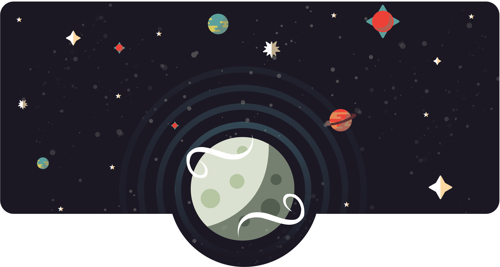

<h1 align="center" size="1">Máni</h1>

<b>Version</b> <small>1.3.0</small>

> An awesome, super simple language!

* Simple and lightweight
* No external dependencies
* Straight recursive descent paser
* Multi-language support

## What is it?
Máni is an interpreted language that is simple to learn, and easy to use.

The idea behind it is, take some of the good parts of other languages like nodejs, c++, python etc.
Implement them into this, and try and build an "Alpha" language... if that is even a such thing.

## What Máni code looks like.
~~~ JS
# "arrays";

class Vector {
    Vector(a, b, c) {
        this.x = a;
        this.y = b;
        this.z = c;
    }

    get() {
        return [this.x, this.y, this.z];
    }

    add(v) {
        if (v is "list") {
            return Vector(this.x+v.at(0), this.y+v.at(1), this.z+v.at(2));
        } else if (v is "number") {
            return Vector(this.x + v, this.y + v, this.z + v);
        } else if (v is "vector") {
            return Vector(this.x + v.x, this.y + v.y, this.z + v.z);
        }
        return nil;
    }

    show() {
        return "[" + this.x + "," + this.y +"," + this.z + "]";
    }

}

let v1 = Vector(1, 2, 3);
let v2 = Vector(4, 5, 6);
let v3 = v1.add(v2);

say v1 + " + " + v2 + " = " + v3;
~~~

## Team
|   [**Brayden Moon**](https://github.com/myxozoa)  |   [**Joe Rickard**](https://github.com/danitacheny)   |
|:----------------:|:----------------:|
|  |   |
| Founder | Contributor |
| [ Github](https://github.com/crazywolf132)  |  [ Github](https://github.com/Kalekdan) |
