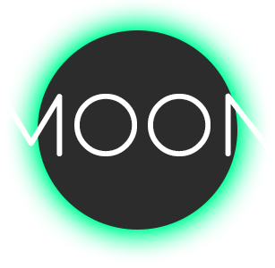

<b>Version</b> <small>1.0.0</small>

> An awesome, super simple language!

* Simple and lightweight
* No external dependencies
* Straight recursive descent paser

[GitHub](https://github.com/crazywolf132/moonlang)
[Lets go!](#Moon-Lang)

